## Identification et contact
La page d'accueil expose la nature des contenus et services proposés. 

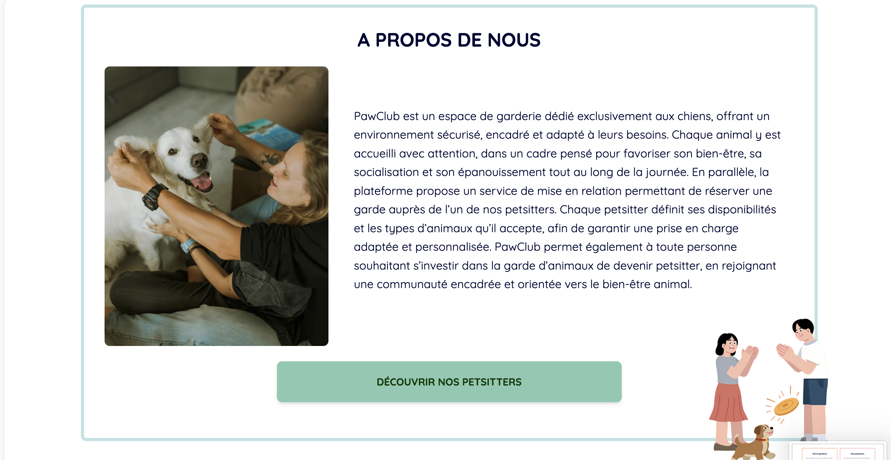
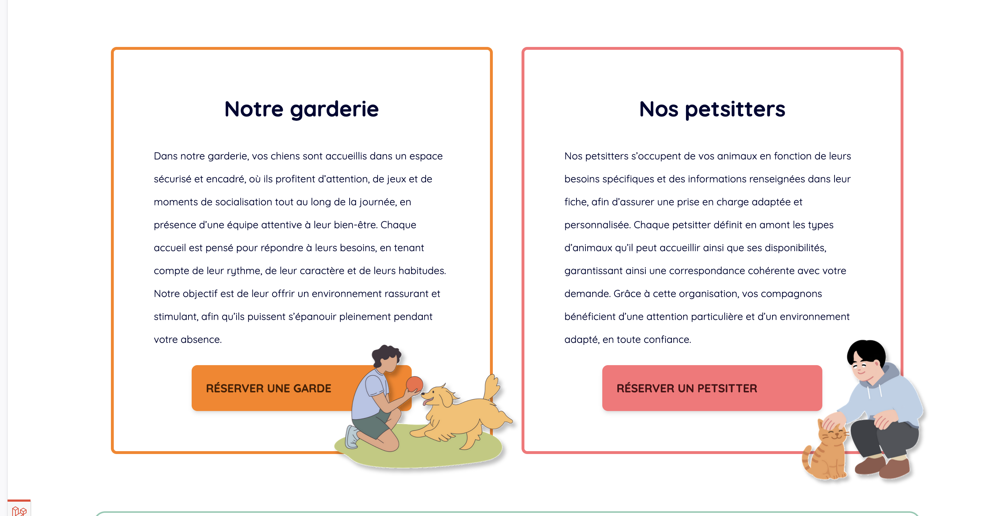

Au moins deux moyens de contact sont proposés. 

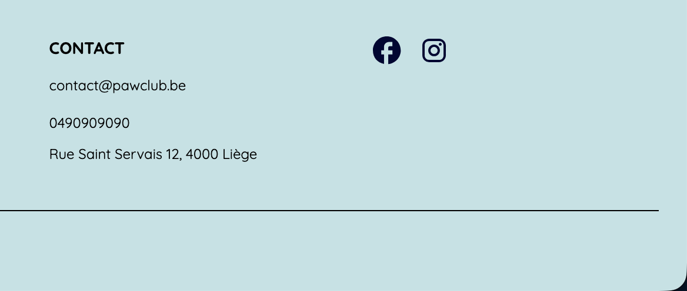

## Internationalisation
Les liens d'accès aux versions traduites pointent directement vers la traduction de la page courante. 
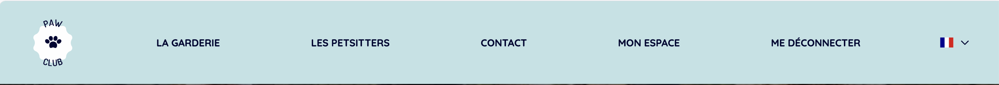

Le code source de chaque page indique la langue principale du contenu. 
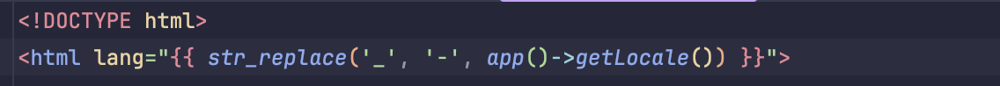

## Navigation 
Il est possible de revenir à la page d'accueil depuis toutes les pages. 

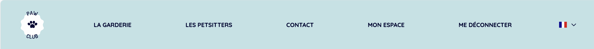

Les items actifs de menu sont signalés. 
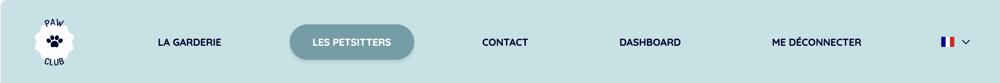

## Présentation
La charte graphique est cohérente sur toutes les pages. 

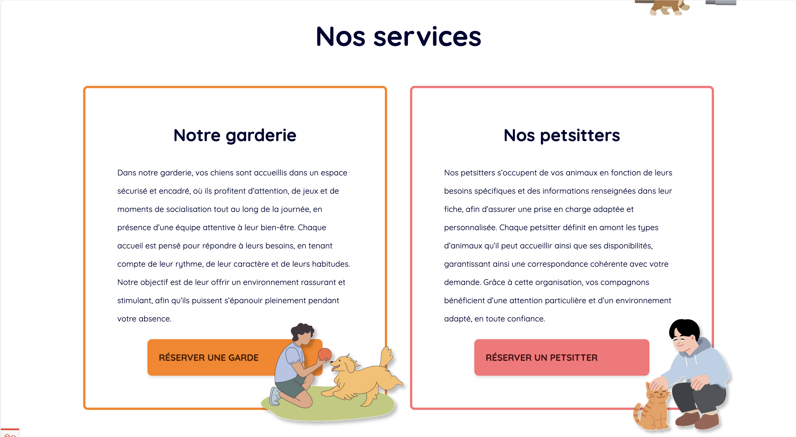
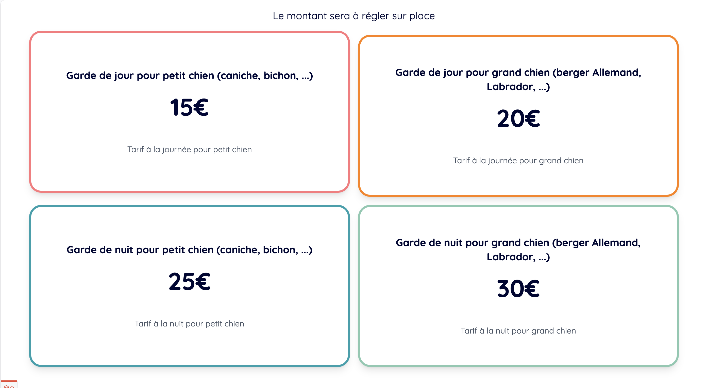
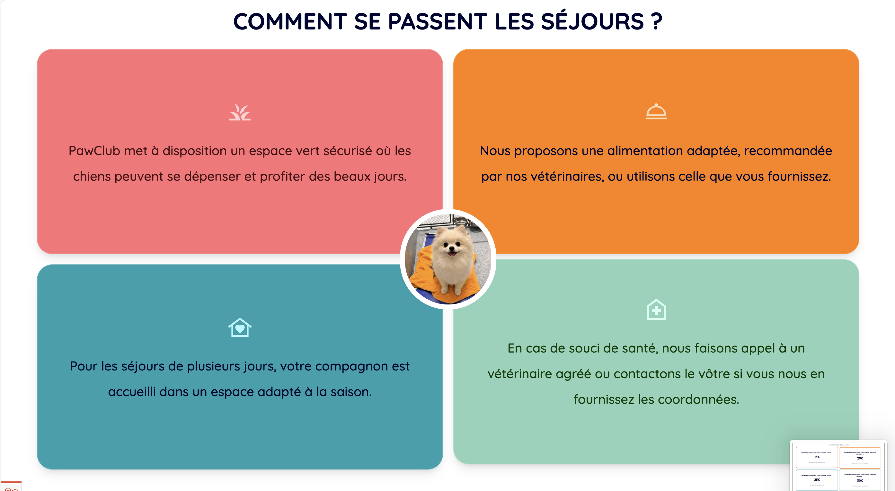
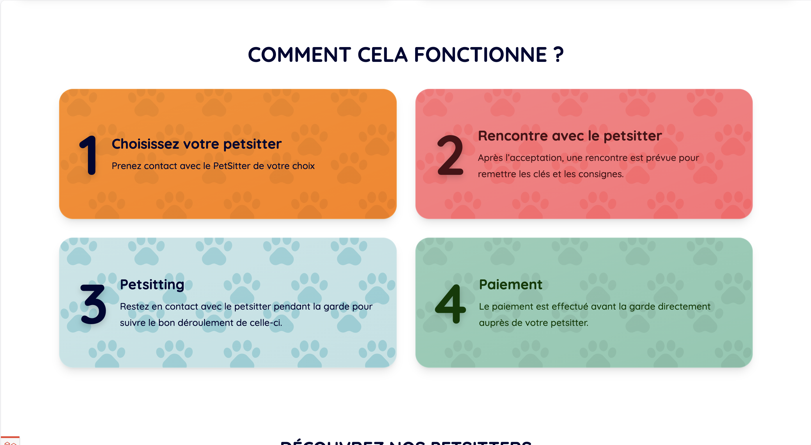

La taille des éléments cliquables est suffisante. 

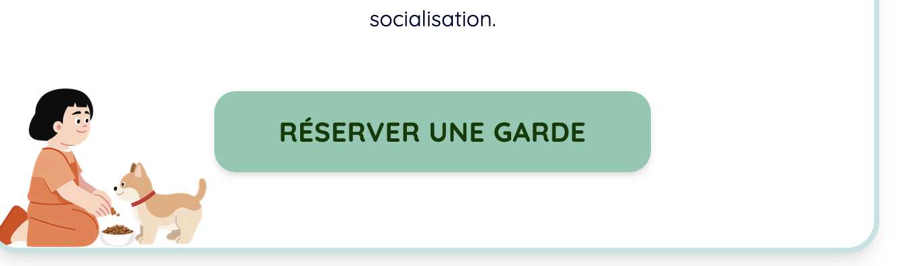
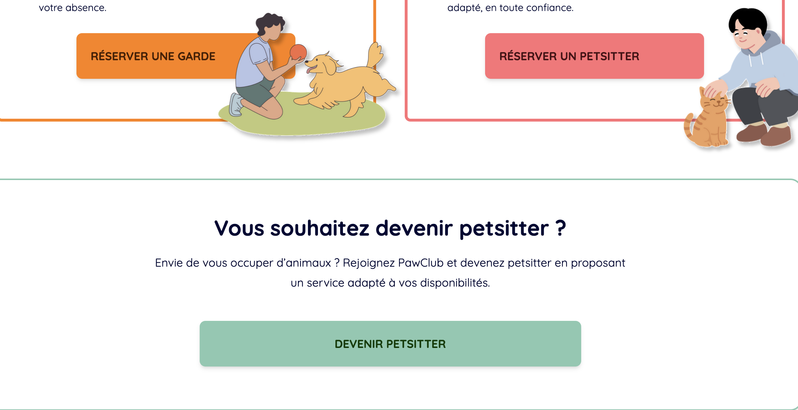
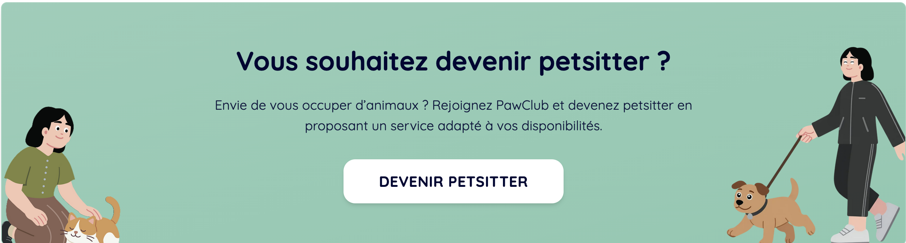

## Structure et code
Le codage de caractères utilisé est UTF-8. 

Le contenu de chaque page est organisé selon une structure de titres et sous-titres hiérarchisée. 

## Données personnelles
La politique de confidentialité et de respect de la vie privée est disponible depuis toutes les pages. 

La création de compte est possible sans recours à un système d'identification tiers. 

## Formulaire
Chaque champ de formulaire est associé dans le code source à une étiquette qui lui est propre. 

L'étiquette de chaque champ de formulaire indique si la saisie est obligatoire. 

## Images et Médias

Chaque image décorative est dotée d'une alternative textuelle appropriée. 

## Liens
Les numéros de téléphone sont activables via le protocole approprié. 

Chaque lien est doté d'un intitulé dans le code source. 

## Serveur et performances 
L'adresse du site fonctionne avec et sans préfixe www.

Le serveur envoie un code HTTP 404 pour les ressources non trouvées. 

## Sécurité
Les mots de passe peuvent être choisis ou changés par l'utilisateur. 

Les mots de passe peuvent être réinitialisés. 

