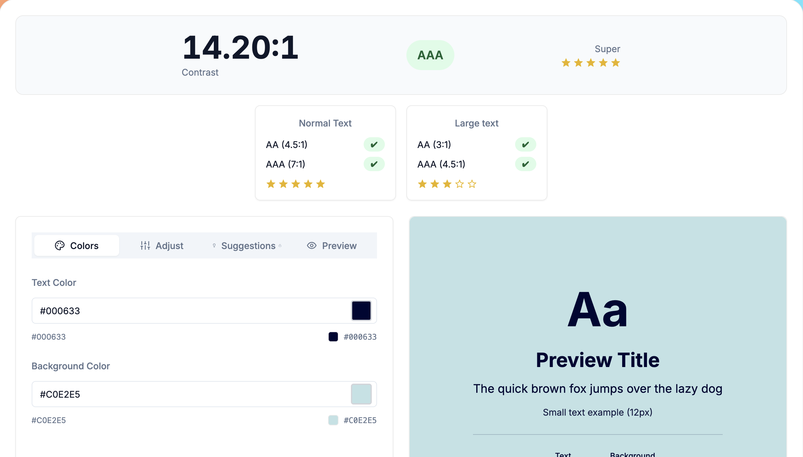
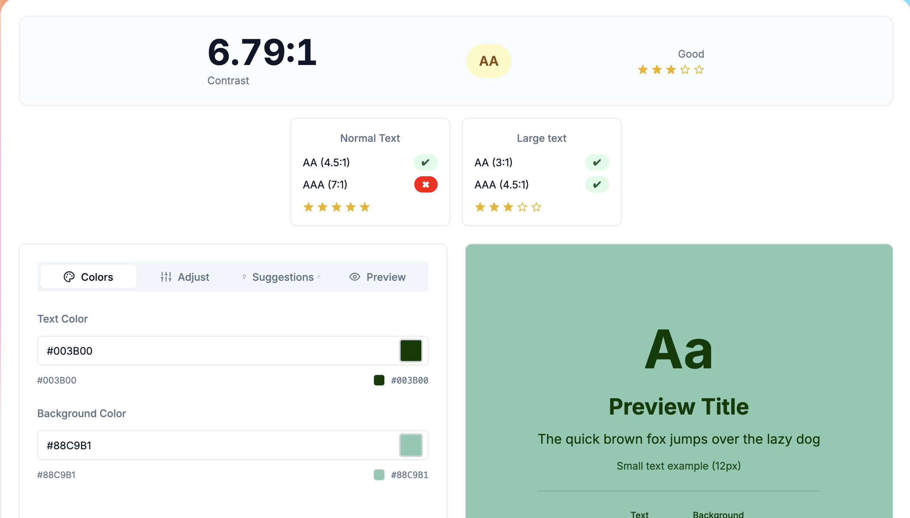
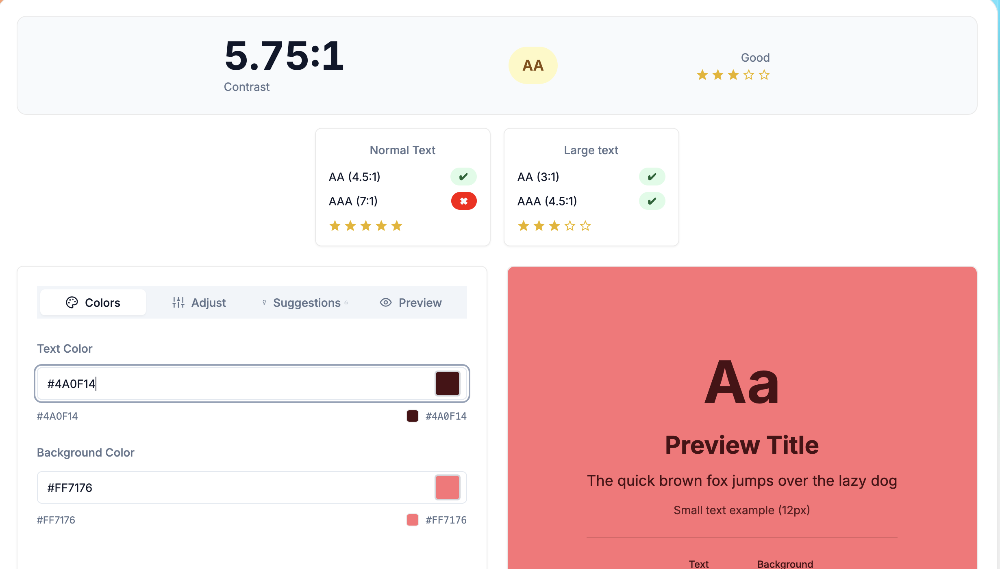
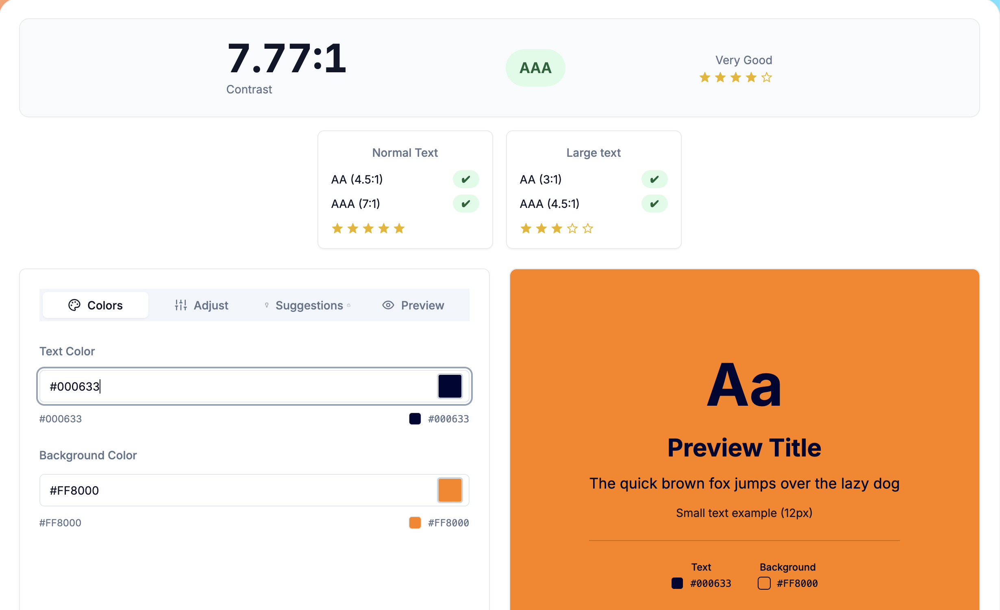
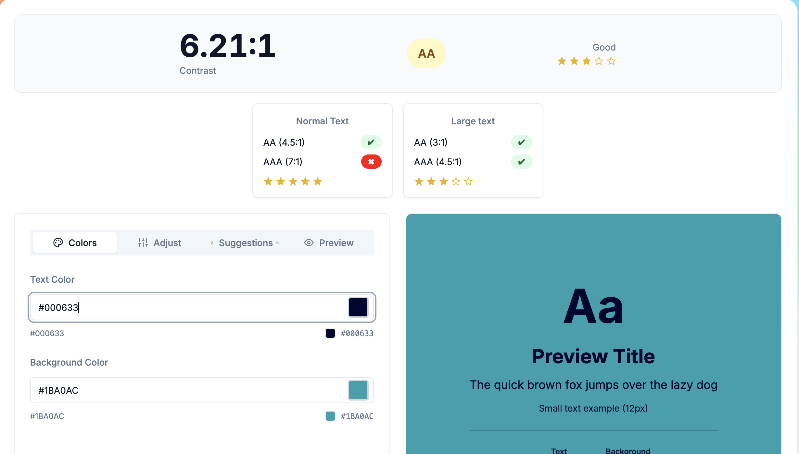

# Rapport de contraste

## Objectif

Cette section présente l'analyse des contrastes de couleurs utilisés dans Paw Club. L'objectif est de vérifier le respect des recommandations d'accessibilité du WCAG (Web Content Accessibility Guidelines) afin de garantir une bonne lisibilité des contenus pour l'ensemble des utilisateurs.
J'ai utilisé le site color picker pour réaliser mes tests de contrasts.
---

## Méthodologie

Les principaux éléments de l'interface ont été analysés :

- Texte principal
- Boutons d'action
- Les éléments d'informations

Les résultats ont été comparés aux exigences WCAG 2.1 :

| Niveau | Ratio minimum |
|----------|----------|
| AA (texte normal) | 4.5:1 |
| AA (grand texte) | 3:1 |
| AAA (texte normal) | 7:1 |

---

## Texte principal

### Analyse

Le contraste du texte principal respecte les recommandations WCAG AA et assure une lecture confortable sur l'ensemble des pages du site.

---

## Boutons principaux

### Analyse

Les boutons d'action présentent un contraste suffisant pour rester clairement identifiables et accessibles.

---

## Element d'information

### Analyse

Les messages système ont été conçus afin d'être identifiables même pour les utilisateurs présentant des déficiences visuelles.

---

## Conclusion

L'analyse des contrastes démontre que Paw Club respecte les exigences d'accessibilité définies par les recommandations WCAG. Les couleurs utilisées garantissent une bonne lisibilité du contenu et contribuent à une expérience utilisateur accessible au plus grand nombre.
