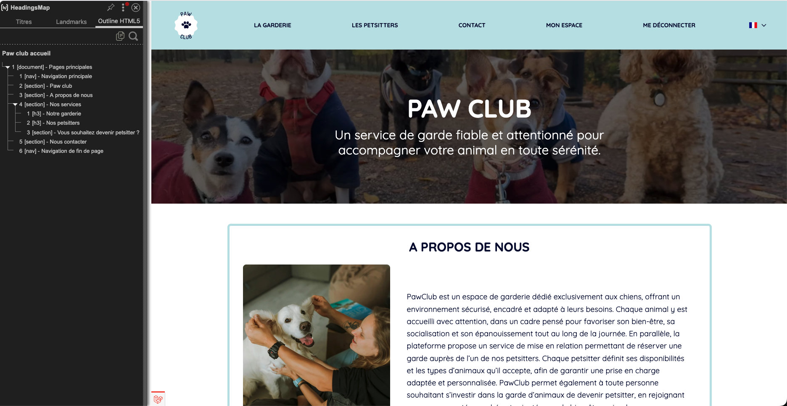
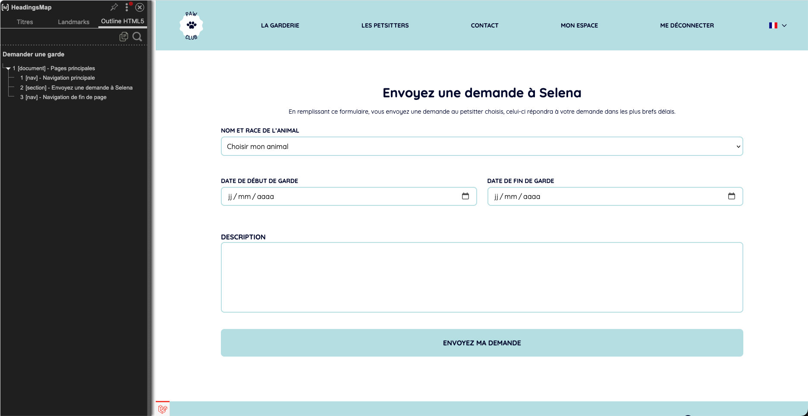
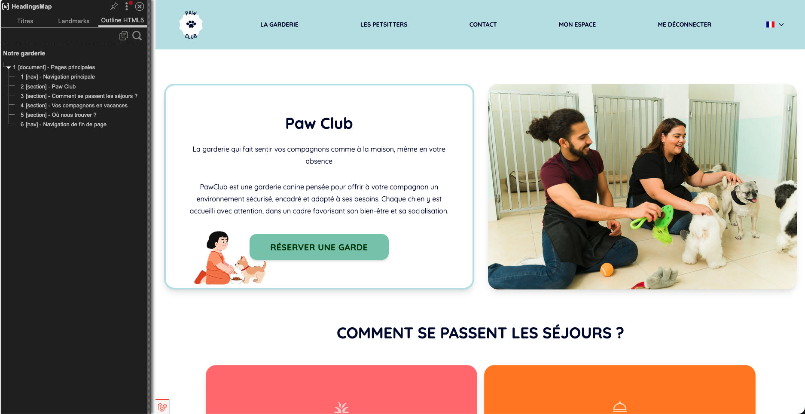
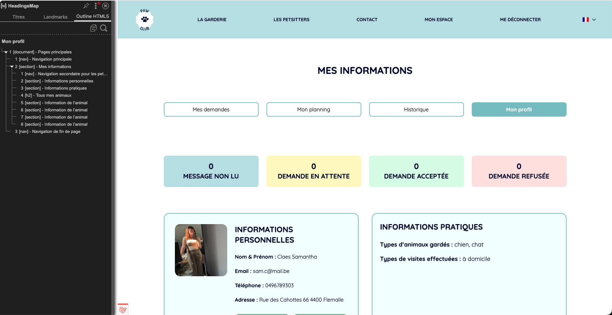
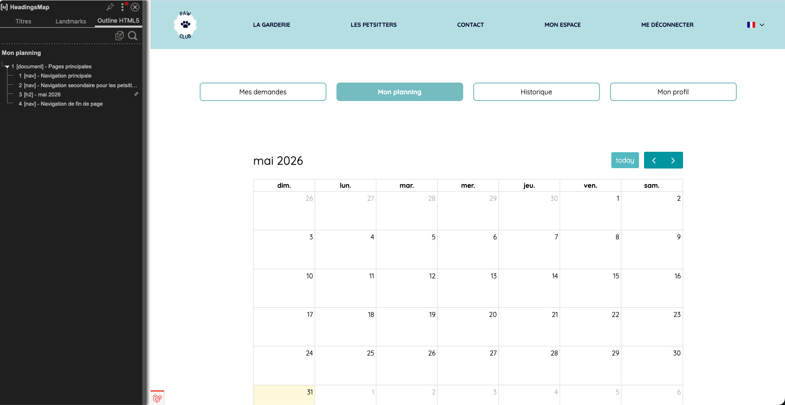
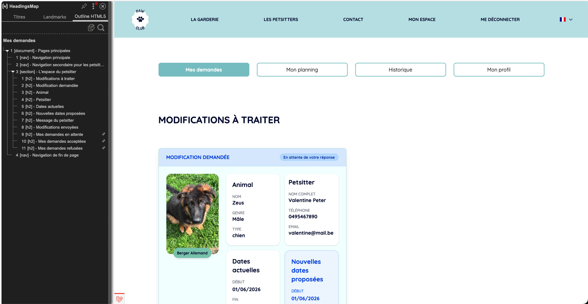

## Objectif

Cette section présente la hiérarchie des titres des principales pages publiques de Paw Club afin de vérifier le respect des bonnes pratiques HTML en matière d'accessibilité et de référencement.

---

## Page d'accueil

### Analyse

- Présence d'un unique H1.
- Hiérarchie cohérente des titres.
- Aucun saut de niveau détecté.
- Structure adaptée aux technologies d'assistance.

---

## Recherche de petsitters

### Analyse

- Présence d'un unique H1.
- Les filtres et les résultats sont clairement séparés.
- Les titres reflètent l'organisation du contenu.

---

## Recherche de garderie

### Analyse

- Présence d'un unique H1.
- Les filtres et les résultats sont clairement séparés.
- Les titres reflètent l'organisation du contenu.

---

## Profil d'un petsitter

### Analyse

- Les informations principales sont correctement hiérarchisées.
- Les différentes sections du profil sont facilement identifiables.
- Structure favorable à la navigation par lecteur d'écran.

---

## Conclusion

Les pages analysées respectent les bonnes pratiques concernant la hiérarchie des titres. Chaque page possède un titre principal unique et une organisation cohérente des niveaux de titres.
