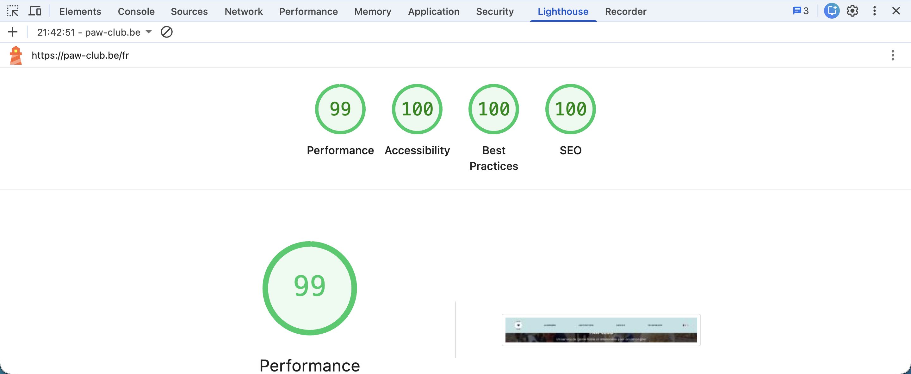
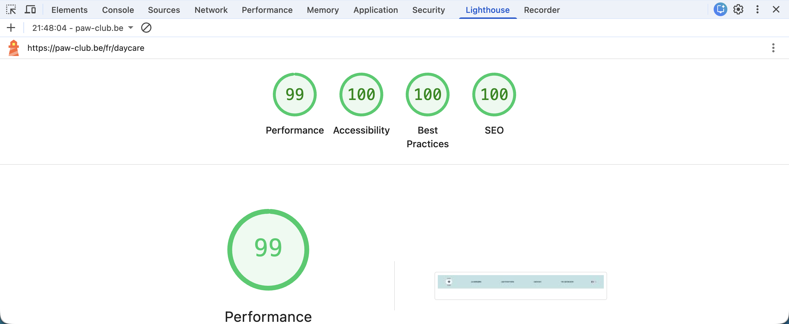
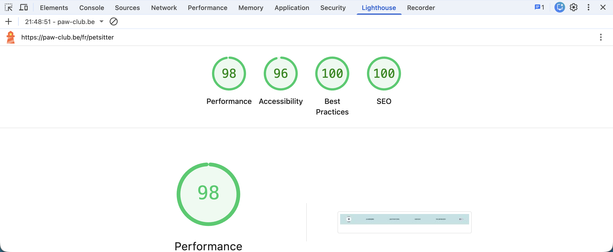
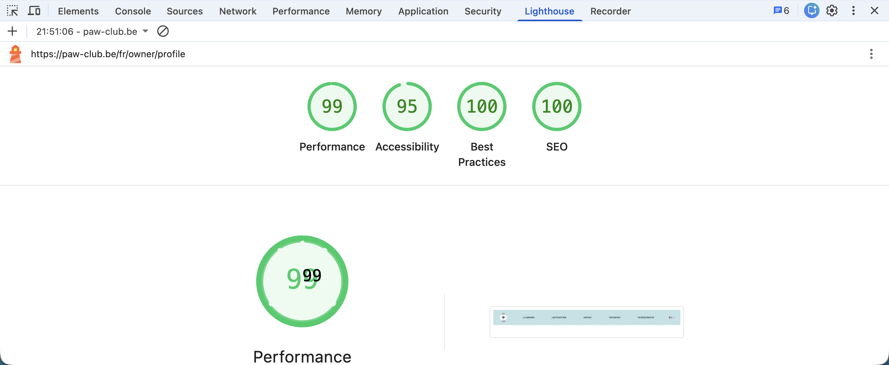

## Objectif

Cette section présente les résultats des audits Lighthouse réalisés sur les principales pages de Paw Club. Lighthouse permet d'évaluer la qualité d'un site web selon quatre critères principaux : les performances, l'accessibilité, les bonnes pratiques et le référencement.

---

## Outil utilisé

Les audits ont été réalisés à l'aide de Lighthouse intégré aux outils de développement de Google Chrome.

Critères évalués :

- Performance
- Accessibility
- Best Practices
- SEO

---

## Page d'accueil

### Résultats

| Critère | Score |
|----------|----------|
| Performance | 99 |
| Accessibility | 100 |
| Best Practices | 100 |
| SEO | 100 |

### Analyse

La page d'accueil obtient d'excellents résultats sur l'ensemble des indicateurs. Les ressources sont correctement optimisées et les bonnes pratiques d'accessibilité sont respectées.

---
## Page garderie

### Résultats

| Critère | Score |
|----------|----------|
| Performance | 99 |
| Accessibility | 100 |
| Best Practices | 100 |
| SEO | 100 |

### Analyse

La page d'accueil obtient d'excellents résultats sur l'ensemble des indicateurs. Les ressources sont correctement optimisées et les bonnes pratiques d'accessibilité sont respectées.

---

## Recherche de petsitters

### Résultats

| Critère | Score |
|----------|----------|
| Performance | 98 |
| Accessibility | 96 |
| Best Practices | 100 |
| SEO | 100 |

### Analyse

Malgré la présence de filtres et de contenus dynamiques, la page conserve de bonnes performances et répond aux recommandations de Lighthouse.

---

## Profil d'un petsitter

### Résultats

| Critère | Score |
|----------|----------|
| Performance | 99 |
| Accessibility | 95 |
| Best Practices | 100 |
| SEO | 100 |

### Analyse

Les images et les informations détaillées du profil n'ont qu'un impact limité sur les performances grâce aux optimisations mises en œuvre.

---

## Optimisations réalisées

Afin d'améliorer les résultats Lighthouse, plusieurs optimisations ont été mises en place :

- Utilisation d'une structure HTML sémantique.
- Respect de la hiérarchie des titres.
- Ajout d'attributs alternatifs sur les images.
- Optimisation et compression des images.
- Limitation des ressources inutiles.
- Mise en cache des ressources statiques.
- Réduction du nombre de requêtes inutiles.

---

## Conclusion

Les audits Lighthouse démontrent que Paw Club respecte les bonnes pratiques modernes du développement web. Les résultats obtenus confirment une attention particulière portée aux performances, à l'accessibilité, au référencement naturel et à l'expérience utilisateur.
